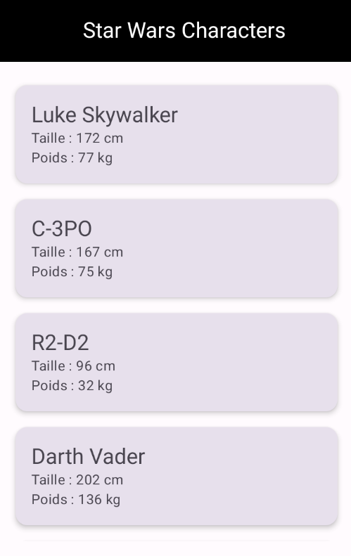

# 🌌 Guerre des Étoiles - Star Wars API App

Une application Android développée en **Kotlin** avec **Jetpack Compose** et **Ktor** qui affiche une liste des personnages de Star Wars en utilisant l'API [SWAPI](https://swapi.dev/).

---

## 📸 **Aperçu**


---

## 🛠 **Technologies utilisées**
- **Kotlin** - Langage principal
- **Jetpack Compose** - UI moderne et réactive
- **Ktor Client** - Requêtes HTTP pour récupérer les données de l'API
- **Material 3** - Design UI moderne
- **Coroutines** - Gestion des tâches asynchrones

---

## 🚀 **Installation et Exécution**
### **1. Cloner le projet**
```sh
git clone https://github.com/Matundu-Jules/Android-Guerre_des_etoiles.git
